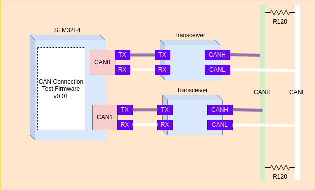
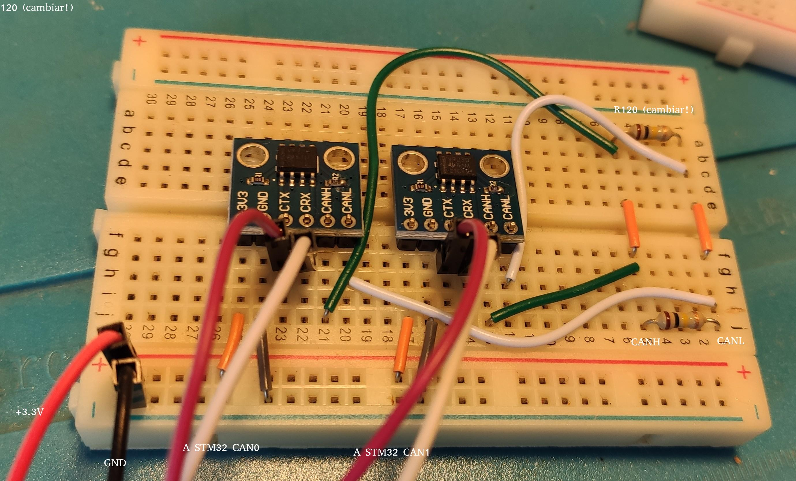
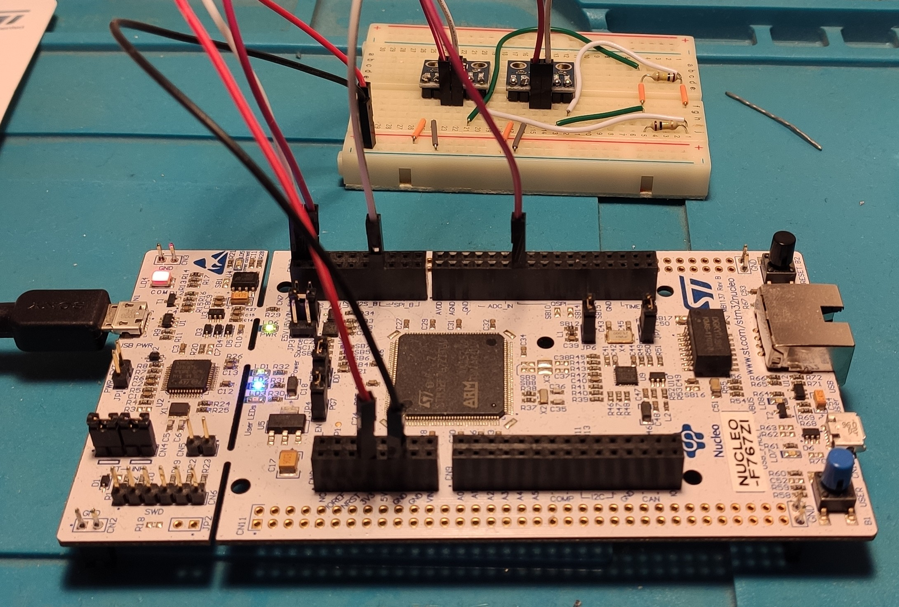
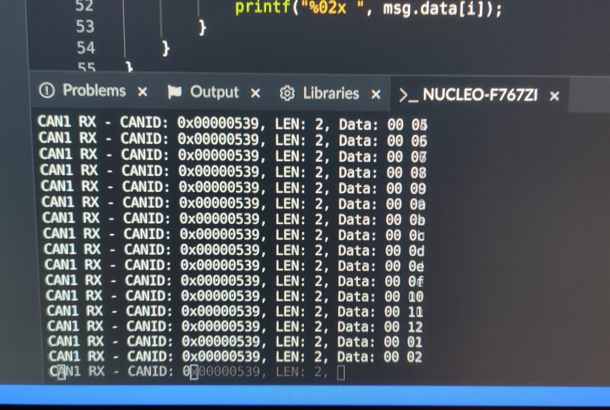

# CAN en STM32xxx (Nucleo 144)

Se describe el conexionado de un ambiente de prueba para STM32F4xxx con dos interfaces CAN conectadas en modo loopback y un código de ejemplo que envía y transmite por ambas.
El propósito es contar con un ambiente inicial como el de la Figura 1 que permita asegurar el correcto funcionamiento de envío y recepción CAN que luego pueda utilizarse como base para otras aplicaciones, como por ejemplo: control u monitoreo desde una PC, simulación de nodos, etc. 

**Diagrama de bloques del ambiente de prueba inicial**

**Nota:** no se muestra la conexión con PC porque en esta primera etapa no es mandatoria. Para validar la comunicación pueden usarse una o más de las siguientes opciones:

- Imprimir el mensaje recibido en cada nodo en la salida de debug.
- Utilizar LEDs que se encienden o apagan dependiendo del contenido de un mensaje.
- Monitorear el bus con un analizador lógico.

## Lista de materiales

Para la prueba se utilizaron los siguientes materiales, pero se pueden utilizar otros modelos de transceivers.

- [Placa Nucleo STM32](https://www.st.com/en/evaluation-tools/nucleo-f429zi.html) con soporte para 2 interfaces CAN.Nota: si la placa sólo tiene una interfaz CAN, se puede usar otro dispositivo más económico para el segundo nodo: Arduino, ESP32, etc.
- [2x transceivers CAN basados en SN65HVD23x](https://www.monarcaelectronica.com.ar/productos/modulo-can-bus-3-3v-sn65hvd230-mona/). Datasheet: https://www.ti.com/lit/an/sloa101b/sloa101b.pdf.2 
- Resistencias de terminación de 120Ω.
- Protoboard, cables, etc.
- Opcional: conectores DB9 (el estándar CAN asigna pines para CANH,CANL y GND).

## Conexionado

En el ejemplo que se muestra a continuación el conexionado utiliza dos controladores CANTX/RX de la STM32F7 con sus respectivos transceivers y conecta ambas interfaces a un mismo bus. Se pueden agregar dispositivos adicionales.Si sólo se dispone de un controlador CAN, se debe conectar el segundo transceiver a otra placa: Arduino, ESP32, etc.

**Fotografìa del conexionado en protoboard**

IMPORTANTE!!! En la foto se usaron resistencias incorrectas, cambiar resistencias por las de 120Ω.

## Asignación de pines para STM32F7

La placa Nucleo basada en STM32F7 tiene hasta tres interfaces CAN disponibles:

Fuente: [https://os.mbed.com/platforms/ST-Nucleo-F767ZI/](https://os.mbed.com/platforms/ST-Nucleo-F767ZI/)

| Componente    | Pin       | Componente   | **Pin** |
| ------------- | --------- | ------------ | ------- |
| Nucleo CAN1RD | CN7.PB_8  | Transceiver1 | CRX     |
| Nucleo CAN1TD | CN7.PB_9  | Transceiver1 | CTX     |
| Nucleo CAN2RD | CN7.PB_5  | Transceiver2 | CRX     |
| Nucleo CAN2TD | CN10.PB_6 | Transceiver2 | CTX     |

## Software de prueba

**Nota**: hay distintos ambientes para desarrollo en STM32: Mbed Studio, STM32Cube, Keil, IAR, etc. Del mismo modo, puede utilizarse un entorno de alto nivel como FreeRTOS o MbedOS o bare-metal con drivers HAL generados desde STM32Cube.Se recomienda utilizar el que resulte más cómodo o para el que haya información disponible: libros, ejemplos, tutoriales en youtube, etc.

### Implementación con Mbed Studio

El código de prueba al que se hace referencia en esta sección se encuentra en: https://github.com/nhorro/stm32_canbus.

#### Aplicación de prueba: envío de mensaje SYNC por canal 1 y recepción en canal 2

Es habitual en algunos protocolos basados en CANBus utilizar un mensaje de sincronismo que se envía a todos los nodos de la red para marcar el tiempo, por ejemplo, utilizando un contador. Este mensaje se envía con alguna periodicidad. En este ejemplo el canal 1 se utiliza para enviar un mensaje SYNC cada 50ms con un contador que se reinicia cada segundo. Esto permite tener 20 subdivisiones de un segundo, pudiendo implementar un lazo de control utilizando los primeros slots para sensar actuadores y los últimos para controlar actuadores (asumiendo un lazo que se repite una vez por segundo).

**Setup conectado a placa Nucleo**

Si todo funciona correctamente, se imprime en consola de debug el mensaje recibido.

**Salida esperada en consola de debug de MBed Studio**

